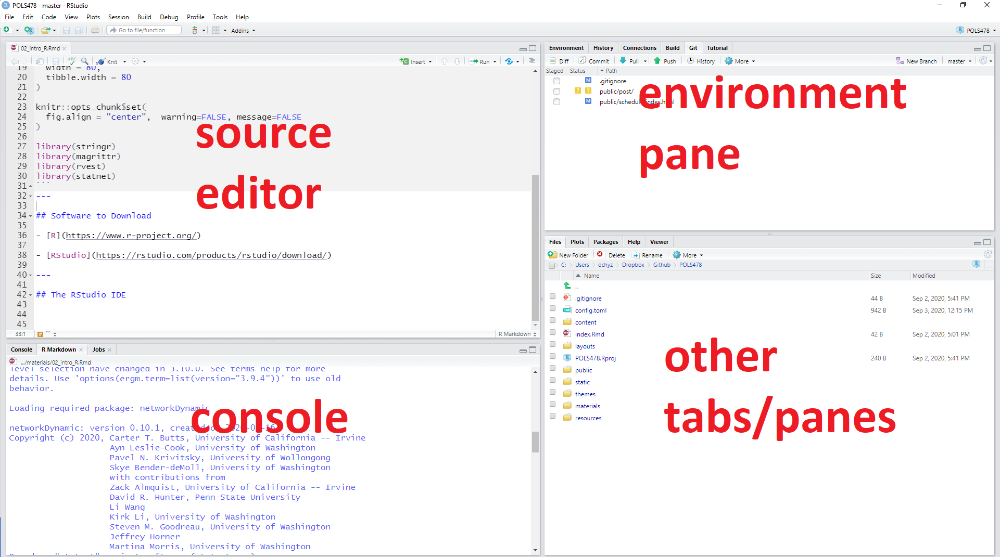
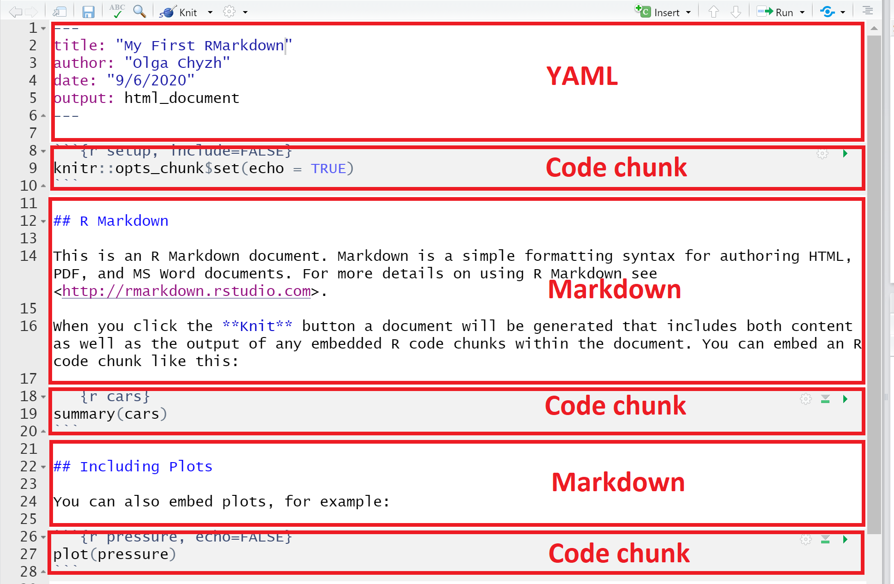

```{r  setup, message=FALSE, warning=FALSE, include=FALSE}
options(
  htmltools.dir.version = FALSE, # for blogdown
  width = 80,
  tibble.width = 80
)

knitr::opts_chunk$set(
  fig.align = "center",  warning=FALSE, message=FALSE
)

```


## Software to Download

- [R](https://www.r-project.org/)

- [RStudio](https://rstudio.com/products/rstudio/download/)

---
## The RStudio IDE

```{r, echo=F, out.width= "1400px",fig.align="center"}

```

---


## Markdown

- Markdown is a **markup** language.

- Markup languages help **produce documents** (e.g., web pages, pdfs) from plain text.

- Other markup languages include **LaTeX**, **HTML**, and **xml**.

- Markdown has become **widespread**. Many websites will generate HTML from Markdown (e.g. GitHub, Stack Overflow, reddit, ...).


---

## Basic Markdown
```{r, eval=F, echo=T}
 *italic*
 **bold**

#Header 1
## Header 2
### Header 3

- List item 1
- List item 2
    - item 2a
    - item 2b

1. Numbered list item 1
2. Numbered list item 2
```

Check out RStudio's [RMarkdown cheat sheet](https://rstudio.com/wp-content/uploads/2015/02/rmarkdown-cheatsheet.pdf)

---

## What is RMarkdown

- R Markdown is a file format for making dynamic documents with R. 

- An R Markdown document is written in Markdown and contains chunks of embedded R code.

- Allows for regenerating the document whenever the code/data/text changes.

---
```{r, echo=F, out.width= "2000px",fig.align="center"}

```

---
