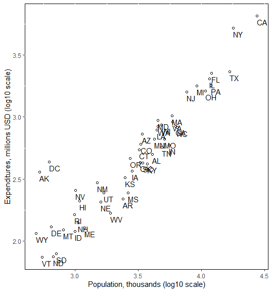

```{r  setup, message=FALSE, warning=FALSE, include=FALSE}
options(
  htmltools.dir.version = FALSE, # for blogdown
  width = 80,
  tibble.width = 80
)

knitr::opts_chunk$set(
  fig.align = "center",  warning=FALSE, message=FALSE
)

```


## Outline

- Input data

- Look at data

- Extract pieces

- Basic graphing in `ggplot2`

---
## Course Data

- Many commands/features in R are a part of a specific package.

- You must install and load the package in order to use these commands/features.

- We have an R package for this class. To install/update, copy and paste the following code into your RStudio source editor and run.

```{r}
library(devtools)
devtools::install_github("ochyzh/classdata")
```

- To load the package (at the beginning of each R session if you plan to use it):

```{r}
library(classdata)
```

---
#Getting Help Within R

If you want to learn about a specific command:
```{r, eval=F}
?command

help("command")

help.search("command")

??command
```


---

## R Reference Card

- http://cran.r-project.org/doc/contrib/Short-refcard.pdf

- Save/print it to reference as you work.

---

## Your Turn (5 min)

- Install the package `classdata` on your computer

- Load the package into your current R session:

```{r}
library(classdata)
```

- Look at the R help for the dataset  `terr_attacks`

- What happens if you just type in the name of the dataset?

---
## Exploring Objects

For any R object `x`, we can use any of the following:

- `x`

- `head(x)`

- `summary(x)`

- `str(x)`

- `dim(x)`

Try these commands on the `terr_attacks` data.

---
## `str` is for *structure*

```{r}
data(terr_attacks)
str(terr_attacks)
```

---
## Extract Parts of an Object

- `x$variable`

- `x[,"variable"]`

- `x[rows, columns]`

- `x$variable[rows]`

`rows` and `columns` are vectors or indices.

Try these commands on the `terr_attacks` data.

---
## Your Turn

- Look at the first 10 rows of the `terr_attacks` data

- Why are some values coded as `NA`? Look at the help for `NA`.


---
## Asking Questions about the Data

Make a list of questions you think you can answer by analyzing these data. Write down as many as you can. 

---

## Possible Answers

- Look at the distribution of a single variable (*bar graph* or *histogram*)

- Look at the relationship between two variables (*scatterplot*, *box plot*, *tile plot*)

- Look how the relationship between two variables is conditional on other variables (*facetting*, *color*, etc.)

---

## Load the Data on Global Terrorist Attacks
```{r}
library(classdata)
data("terr_attacks.wide")
str(terr_attacks.wide)
```

---
## `ggplot2`: Grammar of Graphics

A plot consists of:

1. **mappings** `(aes)`: variables that are mapped to graphical elements

2. **layers:** graphical elements (`geoms` such as points, lines, rectangles, text, etc.) and statistical transformations (`stats` such as identity, counts, bins, etc.)

3. **scales:** map values in the data space to values in the aesthetic space (color, size, shape, position)

4. **coordinate system** `(coord)`: Cartesian, but can be others

5. **facetting:** subsetting and arranging data

6. **theme:** fine-tuning the result, e.g. font, background, margins
---
## Scatterplot

- Need two continuous variables

- `aes`: what variables are you mapping? Scatterplots need a mapping for `x` and a mapping for `y`.

```{r, eval=F}
library(ggplot2)
ggplot(data=terr_attacks.wide, aes(x=`Armed Assault`, y=`Bombing/Explosion`))+geom_point()
ggplot(data=terr_attacks.wide, aes(x=log(`Armed Assault`+1), y=log(`Bombing/Explosion`+1)))+geom_point()
ggplot(data=terr_attacks.wide, aes(x=`Armed Assault`+1, y=`Bombing/Explosion`+1))+geom_point()+scale_x_log10("Armed Assault")+scale_y_log10("Bombing/Explosion")

```

---
## Interpreting Scatterplots

- General patterns
  - Form and direction
  - Strength 

- Localized patterns

- Deviations from the pattern
  - Outliers
  
---

```{r, echo=F, out.width= "350px",fig.align="center"}

```

> 1. <font color="darkorange">Form: Roughly linear, several distinct groups</font>
> 2. <font color="darkorange">Strength: pretty strong.  Data points form a line.
</font>
> 3. <font color="darkorange">Direction: Positively Associated.
</font>
> 4. <font color="darkorange">Outliers: AK, DC, NY, CA.</font>

---
  


```{r, eval=F}
terr_attacks.wide$dem<-"Aut"
terr_attacks.wide$dem[terr_attacks.wide$polity2>7]<-"Dem"
ggplot(data=terr_attacks.wide, aes(x=`Armed Assault`+1, y=`Bombing/Explosion`+1, colour=dem))+geom_point()+scale_x_log10("Armed Assault")+scale_y_log10("Bombing/Explosion") 
ggplot(data=terr_attacks.wide, aes(x=`Armed Assault`+1, y=`Bombing/Explosion`+1, colour=dem,size=GDPpc))+geom_point()+scale_x_log10("Armed Assault")+scale_y_log10("Bombing/Explosion") 
```

```{r, echo=F, out.width= "350px"}
library(ggplot2)
terr_attacks.wide$dem<-"Aut"
terr_attacks.wide$dem[terr_attacks.wide$polity2>7]<-"Dem"
ggplot(data=terr_attacks.wide, aes(x=`Armed Assault`+1, y=`Bombing/Explosion`+1, colour=dem,size=GDPpc))+geom_point()+scale_x_log10("Armed Assault")+scale_y_log10("Bombing/Explosion") 
```

