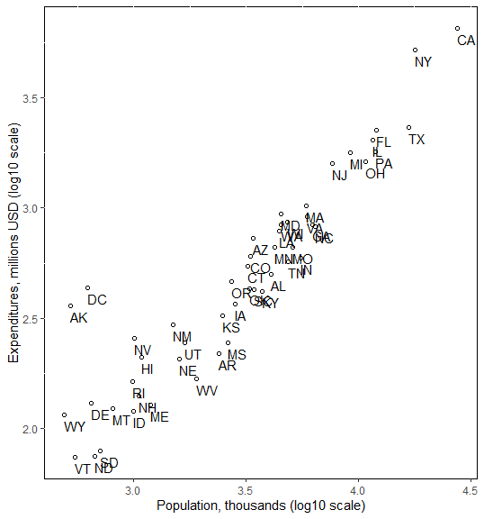

```{r  setup, message=FALSE, warning=FALSE, include=FALSE}
options(
  htmltools.dir.version = FALSE, # for blogdown
  width = 80,
  tibble.width = 80
)

knitr::opts_chunk$set(
  fig.align = "center",  warning=FALSE, message=FALSE
)

```

## Bad Visualizations


```{r, echo=F, out.width= "1400px",fig.align="center"}

```

---

## Bad Visualizations


```{r, echo=F, out.width= "1400px",fig.align="center"}

```

---

## Bad Visualizations

### Younger adults are large percentage of coronavirus hospitalizations in United States, according to new CDC data

```{r, echo=F, out.width= "900px",fig.align="center"}

```

Source: [The Washington Post](https://www.washingtonpost.com/health/2020/03/19/younger-adults-are-large-percentage-coronavirus-hospitalizations-united-states-according-new-cdc-data/)
---

## Bad Visualizations

```{r, echo=F, out.width= "500px",fig.align="center"}

```

Source: Roeder K (1994) DNA fingerprinting: A review of the controversy (with discussion). Statistical Science 9:222-278, Figure 4

---

## Want More?

[Visit Karl Broman's Website](https://www.biostat.wisc.edu/~kbroman/topten_worstgraphs/)

---

## Asking Questions about the Data

Make a list of questions you think you can answer by analyzing the data on terrorist attacks. Write down as many as you can. 

---

## Possible Answers

- Look at the distribution of a single variable (*bar graph* or *histogram*)

- Look at the relationship between two variables (*scatterplot*, *box plot*, *tile plot*)

- Look how the relationship between two variables is conditional on other variables (*facetting*, *color*, etc.)

---

## Load the Data on Global Terrorist Attacks
```{r}
library(classdata)
data("terr_attacks.wide")
str(terr_attacks.wide)
```

---
## `ggplot2`: Grammar of Graphics

A plot consists of:

1. **mappings** `(aes)`: variables that are mapped to graphical elements

2. **layers:** graphical elements (`geoms` such as points, lines, rectangles, text, etc.) and statistical transformations (`stats` such as identity, counts, bins, etc.)

3. **scales:** map values in the data space to values in the aesthetic space (color, size, shape, position)

4. **coordinate system** `(coord)`: Cartesian, but can be others

5. **facetting:** subsetting and arranging data

6. **theme:** fine-tuning the result, e.g. font, background, margins
---
## Scatterplot

- Need two continuous variables

- `aes`: what variables are you mapping? Scatterplots need a mapping for `x` and a mapping for `y`.

```{r, eval=F}
library(ggplot2)
ggplot(data=terr_attacks.wide, aes(x=`Armed Assault`, y=`Bombing/Explosion`))+geom_point()
ggplot(data=terr_attacks.wide, aes(x=log(`Armed Assault`+1), y=log(`Bombing/Explosion`+1)))+geom_point()
ggplot(data=terr_attacks.wide, aes(x=`Armed Assault`+1, y=`Bombing/Explosion`+1))+geom_point()+scale_x_log10("Armed Assault")+scale_y_log10("Bombing/Explosion")

```

---
## Interpreting Scatterplots

- General patterns
  - Form and direction
  - Strength 

- Localized patterns

- Deviations from the pattern
  - Outliers
  
---

```{r, echo=F, out.width= "350px",fig.align="center"}

```

> 1. <font color="darkorange">Form: Roughly linear, several distinct groups</font>
> 2. <font color="darkorange">Strength: pretty strong.  Data points form a line.
</font>
> 3. <font color="darkorange">Direction: Positively Associated.
</font>
> 4. <font color="darkorange">Outliers: AK, DC, NY, CA.</font>

---

## Looking at Conditional Relationships

- Can use color, size, shape, etc. to show additional information

- E.g., can color observations based on regime type. (Why?)

  - Data Management Tool \#1: Recoding


```{r, eval=F}
terr_attacks.wide$dem<-"Aut"
terr_attacks.wide$dem[terr_attacks.wide$polity2>7]<-"Dem"
```

---
## Color by Regime Type

```{r, echo=T, out.width= "350px"}
library(ggplot2)
terr_attacks.wide$dem<-"Aut"
terr_attacks.wide$dem[terr_attacks.wide$polity2>7]<-"Dem"
ggplot(data=terr_attacks.wide, aes(x=`Armed Assault`+1, y=`Bombing/Explosion`+1, colour=dem,size=GDPpc))+geom_point()+scale_x_log10("Armed Assault")+scale_y_log10("Bombing/Explosion") 

```


---

## Facetting

Can facet to display plots of subsets of data: `facet_wrap`, `facet_grid`

- E.g., can facet by region, year, etc.

---

## More Recoding 

- Code the `region` variable from `ccode`.

```{r}
terr_attacks.wide$region<-NA
terr_attacks.wide$region[terr_attacks.wide$ccode<200]<- "The Americas"
terr_attacks.wide$region[terr_attacks.wide$ccode>=200 & terr_attacks.wide$ccode<401]<- "Europe"

```

---
## Your Turn

Code the rest of the values of `region` using the following coding scheme:


| ccode  | region |
| ------------- | ------------- |
| 401--627  | Africa  |
| 628--699  | Middle East  |
| 700--899  | Asia  |
| $\geq$ 900  | Australia and Oceania  |

```{r, echo=F}
terr_attacks.wide$region[terr_attacks.wide$ccode>=401 & terr_attacks.wide$ccode<627]<- "Africa"
terr_attacks.wide$region[terr_attacks.wide$ccode>=628 & terr_attacks.wide$ccode<699]<- "Middle East"
terr_attacks.wide$region[terr_attacks.wide$ccode>=700 & terr_attacks.wide$ccode<899]<- "Asia"
terr_attacks.wide$region[terr_attacks.wide$ccode>=900]<- "Australia and Oceania"


```
---

## Facet by Region
```{r, out.width= "350px"}
ggplot(data=terr_attacks.wide, aes(x=`Armed Assault`+1,y=`Bombing/Explosion`+1,colour=dem,size=GDPpc))+facet_wrap(~region)+geom_point()+scale_y_log10("Bombing/Explosion")+scale_x_log10("Armed Assault")
```

