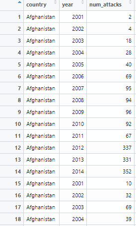

```{r  setup, message=FALSE, warning=FALSE, include=FALSE}
options(
  htmltools.dir.version = FALSE, # for blogdown
  width = 80,
  tibble.width = 80
)

knitr::opts_chunk$set(
  fig.align = "center",  warning=FALSE, message=FALSE
)

```

## Example 1

Question: Are democracies more vulnerable to terrorist attacks?

Motivation: 
 
- Civil liberties (privacy, freedom of movement) facilitate communication and planning;
 
- Freedom of the press amplifies the audience effect of attacks.

---
## Load the Data

```{r}
library(classdata)
data("terr_attacks")
str(terr_attacks)
```

---
## Step 1: Explore the Data

- The variables of interest are `num_attacks` and `polity2`;

```{r, eval=F}
summary(terr_attacks[,c("num_attacks","polity2")])
```

- Check how each variable is coded, recode as needed
  
  - Address any missingness
  
      - There are 320 missing values on the `polity2` variable.

      - It is safe to assume that regimes with "unknown" regime types are not democracies.
```{r}
terr_attacks$dem<-"Aut"
terr_attacks$dem[terr_attacks$polity2>7]<-"Dem"

```

  


*The `polity2` variable is obtained from (the Polity V Project)[http://www.systemicpeace.org/inscrdata.html]. Go to its website to check out its codebook.

---

## Step 2: Set Up the Data

- The unit of analysis in the `terr_attacks` data is country-year.

- Our research question asks for a comparison among country-types (democracies vs non-democracies).

- Need to *aggregate* data by regime type, make regime type the unit of analysis.


---
## Data Management Tool #2: Aggregating

.pull-left[
```{r, echo=F, out.width= "250px",fig.align="center"}

```
]

.pull-right[
```{r, echo=F, out.width= "250px",fig.align="center"}

```
]

---
## Aggregating using `summarise`

```{r}
library(tidyverse)
library(magrittr)
attks <-terr_attacks %>%
  group_by(dem) %>%
  summarise(`num_attacks`=mean(`num_attacks`),.groups="keep")
```

*Note that `%>%` is called the pipe operator and means "then", i.e. the code above says "group by country, then summarise the number of armed assaults"
---

## `num_attacks` by Regime Type

```{r,out.width= "250px",fig.align="center"}
library(ggplot2)
#Set theme options:
theme_set(theme_grey() + theme(panel.background = element_rect(fill = NA, color = 'black'))+ theme(axis.text=element_text(size=10),
					axis.title=element_text(size=12,face="bold")))

ggplot(data=attks, aes(x=dem,y=num_attacks))+geom_bar(stat="identity", fill="gray80", width=.5)+ylab("Average Number of Attacks")+scale_x_discrete("Regime Type")+coord_flip()

```

---
## Your Turn

- Aggregate the data to show the mean and the median GDP/cap for each country over the entire time-period, i.e. your unit of analysis will be country rather than country-year.

Hint: Use `?summarise` to find out how to get the median.


---
## Adding Nuance

Are democracies more vulnerable to certain types of attacks?

- Need to aggregate by regime *and* attack type

```{r}
attks1 <-terr_attacks %>%
  group_by(dem, type) %>%
  summarise(`num_attacks`=mean(`num_attacks`),.groups="keep")

```

---
## Your Turn

- Plot number attacks by regime type. Facet by the type of attack.

- Are democracies more vulnerable to certain types of attacks? Which ones? Why do you think that is?


```{r, echo=F, eval=F}
ggplot(data=attks1, aes(x=dem,y=num_attacks))+geom_bar(stat="identity", fill="gray80", width=.5)+ylab("Average Number of Attacks")+scale_x_discrete("Regime Type")+facet_wrap(~type, scales = "free")+coord_flip()
```


---
## What We Learned

- Dealing with missing data

- Aggregating using `summarise`

- Bar graphs

- Setting theme, fill, and the system of coordinates

